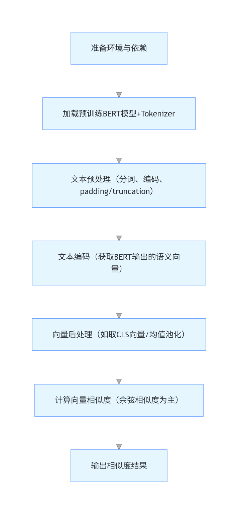

# 如何使用bert 进行文本编码，并且使用bert 进行相似度计算，需要写清楚技术方案；

### 1. 文本编码流程:
文本编码的目标是将原始文本转换为固定维度的语义向量，步骤如下:

- 分词（Tokenization）：使用BERT对应的分词器（如BertTokenizer）将文本拆分为子词（Subword），并添加特殊标记：
- 转换为模型输入格式: 将分词结果转换为BERT可接受的输入张量
- BERT模型编码: 将输入张量传入预训练BERT模型（如bert-base-uncased），通过多层Transformer编码器提取上下文语义特征
- 生成句向量: 从BERT输出中提取句级向量
- 相似度计算: 使用余弦相似度（最常用）衡量两个归一化向量的夹角余弦值，范围为[−1,1]，值越大表示语义越相似
- 输出结果: 根据余弦相似度值判断文本相似度
